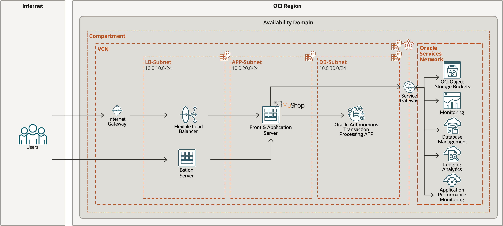

# IaC: Compute の冗長化を実施しよう

## 問題

現在の構成は以下のようになっており、Flexible Load Balancer（以下、FLB） には、アプリケーションがホストされている Compute Instance がバックエンドとして登録されています。



サービスの成長に伴い、求められる応答性能が中々満たせなくなってきました。また、Compute Instance は 1 台で構成されているため、Compute Instance が何らかの原因で落ちてしまった際は、サービスが停止してしまいます。これらの問題に対応するために、同様の Compute Instance をもう 1 台作成し、それを FLB のバックエンドとして登録することで、1 台あたりの負荷を下げるような構成を作成してみましょう！

### 条件

この問題はいくつかの解法が存在しますが、方法に応じて得られる得点が変化します。以下の要素を組み込んでもらうと得られる得点が高くなります。難しい場合は、手動で対応していただいても大丈夫です。

- 今後のメンテナンス性などを鑑みて、Terraform で冗長構成を作成する
<!-- - 既存の Compute Instance を停止しないように冗長構成を作成する -->

## 解答

### 手動で対応する場合

<!-- TODO: 曽川さん -->

### Terraform で対応する場合

各ファイルを以下のように修正します。

`compute.tf`

```diff
resource "oci_core_instance" "mushop_app_instance" {
+  count = 2
  availability_domain = local.ad
  compartment_id      = var.compartment_ocid
  display_name        = format("%s-mushop-app", var.team_name)
  shape               = local.shape
  shape_config {
    ocpus         = 1
    memory_in_gbs = 16
  }
  source_details {
    source_type = "image"
    source_id   = local.image
  }
  create_vnic_details {
    subnet_id        = oci_core_subnet.mushop_app_subnet.id
    display_name     = "primaryvnic"
    assign_public_ip = false
-   hostname_label   = format("%s-mushop-app", var.team_name)
+   hostname_label   = format("%s-mushop-app-%s", var.team_name, count.index)
  }
  metadata = {
    ssh_authorized_keys = var.public_key
    user_data           = data.cloudinit_config.mushop.rendered
  }
}
```

`loadbalancer.tf`

```diff
resource "oci_load_balancer_backend" "mushop-backend" {
+ count = 2
  load_balancer_id = oci_load_balancer_load_balancer.mushop_lb.id
  backendset_name  = oci_load_balancer_backend_set.mushop_backend_set.name
- ip_address       = oci_core_instance.mushop_app_instance.private_ip
+ ip_address       = oci_core_instance.mushop_app_instance[count.index].private_ip
  port             = 80
  backup           = false
  drain            = false
  offline          = false
  weight           = 1
}
```

`output.tf`

```diff
output "app_private_ip" {
-  value = oci_core_instance.mushop_app_instance.private_ip
+  value = [
+    for instance in oci_core_instance.mushop_app_instance : instance.private_ip
+  ]
}
```

あとは、Resource Manager にて適用（任意で計画も）を実行すれば OK です。
