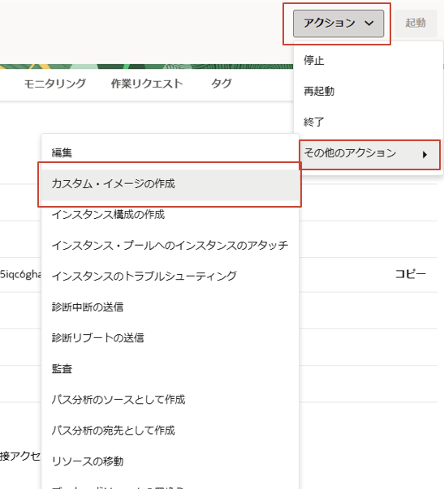

# IaC: Compute の冗長化を実施しよう

## 問題

現在の構成は以下のようになっており、Flexible Load Balancer（以下、FLB） には、アプリケーションがホストされている Compute Instance がバックエンドとして登録されています。


サービスの成長に伴い、求められる応答性能が中々満たせなくなってきました。また、Compute Instance は 1 台で構成されているため、Compute Instance が何らかの原因で落ちてしまった際は、サービスが停止してしまいます。これらの問題に対応するために、同様の Compute Instance をもう 1 台作成し、それを FLB のバックエンドとして登録することで、1 台あたりの負荷を下げるような構成を作成してみましょう！

### 条件

この問題はいくつかの解法が存在しますが、方法に応じて得られる得点が変化します。以下の要素を組み込んでもらうと得られる得点が高くなります。難しい場合は、手動で対応していただいても大丈夫です。

- 今後のメンテナンス性などを鑑みて、Terraform で冗長構成を作成する
<!-- - 既存の Compute Instance を停止しないように冗長構成を作成する -->

## 解答

### 手動で対応する場合

OCI コンソール画面左上のハンバーガーメニューから、「コンピュート」→「インスタンス」を選択します。


アプリケーションをホストしている既存のインスタンスを選択し、インスタンスの詳細画面に移動します。


画面右上にある「アクション」→「その他のアクション」→「カスタム・イメージの作成」を選択します。



名前は任意の名前を入力し、「カスタム・イメージの作成」を選択します。カスタムイメージが作成されるまでしばらく待ちます。


カスタムイメージが作成されたら、インスタンス一覧のページに戻り、「インスタンスの作成」を選択します。


インスタンスの作成ページが表示されるので、任意の名前を設定後、「イメージの変更」を選択します。


イメージの選択画面が表示されるので、「マイ・イメージ」→「カスタム・イメージ」→「先ほど作成したカスタムイメージ」を選択し、「イメージの選択」を選択します。


ネットワーキングの設定まではデフォルト値のまま「次」を選択します。ネットワーキングの設定では、アプリケーションのホストされているインスタンスと同じサブネットに配置するように設定します。


下にスクロールすると「SSH キーの追加」の項目がありますが、作成したカスタムイメージに既に含まれているので「SSH キーなし」を選択します。


残りの項目はすべてデフォルトのまま「次」を選択し、インスタンスを作成します。

次に、ロードバランサ―と作成したインスタンスを紐づけるため、ロードバランサ―のバックエンドセットに作成したインスタンスを登録します。
画面左上にあるハンバーガーメニューから、「ネットワーキング」→「ロード・バランサ」を選択します。


既存のロードバランサを選択し、ロードバランサの詳細画面に移動します。「バックエンド・セット」→「既存のバックエンド・セット」を選択します。


バックエンド・セットの詳細画面が開くので、「バックエンド」→「バックエンドの追加」を選択します。


バックエンド・タイプはデフォルト（コンピュート・インスタンス）を選択し、インスタンスの追加を選択します。


先ほど作成したインスタンスを選択し、「インスタンスの追加」を選択します。


残りの項目はデフォルトのまま、バックエンドの追加を完了します。ヘルスが「OK」になれば完了です。


### Terraform で対応する場合

各ファイルを以下のように修正します。

`compute.tf`

```diff
resource "oci_core_instance" "mushop_app_instance" {
+ count = 2
  availability_domain = local.ad
  compartment_id      = var.compartment_ocid
  display_name        = format("%s-mushop-app", var.team_name)
  shape               = local.shape
  shape_config {
    ocpus         = 1
    memory_in_gbs = 16
  }
  source_details {
    source_type = "image"
    source_id   = local.image
  }
  create_vnic_details {
    subnet_id        = oci_core_subnet.mushop_app_subnet.id
    display_name     = "primaryvnic"
    assign_public_ip = false
-   hostname_label   = format("%s-mushop-app", var.team_name)
+   hostname_label   = format("%s-mushop-app-%s", var.team_name, count.index)
  }
  metadata = {
    ssh_authorized_keys = var.public_key
    user_data           = data.cloudinit_config.mushop.rendered
  }
}
```diff
resource "oci_core_instance" "mushop_bastion" {
+  count = 2
  availability_domain = local.ad
  compartment_id      = var.compartment_ocid
  display_name        = format("%s-mushop-bastion", data.oci_identity_compartment.team_compartment.name)
  shape               = local.shape
  shape_config {
    ocpus         = 1
    memory_in_gbs = 6
  }
  source_details {
    source_type = "image"
    source_id   = local.image
  }
  create_vnic_details {
    subnet_id        = local.lb_subnet.id
    display_name     = "primaryvnic"
    assign_public_ip = true
-   hostname_label   = format("%s-mushop-bastion", data.oci_identity_compartment.team_compartment.name)
+   hostname_label   = format("%s-mushop-bastion-%s", data.oci_identity_compartment.team_compartment.name, count.index)
    /* ↓↓↓　SLからNSGの変更に伴い追加 by Masataka Marukawa ↓↓↓ */
    nsg_ids = [
      local.bastion_nsg.id
    ]
    /* ↑↑↑ SLからNSGの変更に伴い追加 by Masataka Marukawa　↑↑↑ */
  }
```


`loadbalancer.tf`

```diff
resource "oci_load_balancer_backend" "mushop-backend" {
+ count = 2
  load_balancer_id = oci_load_balancer_load_balancer.mushop_lb.id
  backendset_name  = oci_load_balancer_backend_set.mushop_backend_set.name
- ip_address       = oci_core_instance.mushop_app_instance.private_ip
+ ip_address       = oci_core_instance.mushop_app_instance[count.index].private_ip
  port             = 80
  backup           = false
  drain            = false
  offline          = false
  weight           = 1
}
```

`output.tf`

```diff
output "app_private_ip" {
-  value = oci_core_instance.mushop_app_instance.private_ip
+  value = [
+    for instance in oci_core_instance.mushop_app_instance : instance.private_ip
+  ]
}
```

修正したフォルダを Resource Manager のスタックに反映させます。OCI コンソール画面左上のハンバーガーメニューから、「開発者サービス」→「リソースマネージャ - スタック」を選択します。


当クエスト環境を作成するときに用いたスタックを選択し、スタックの詳細画面を開きます。


「編集」→「スタックの編集」を選択します。


Terraform 構成ソースで「フォルダ」を選択し、修正を加えたコードのフォルダをアップロードし、変更を保存します。


変更保存のスタックを用いて、再度「適用」をクリックし、リソースを作成します。


適用後、ジョブの状態が「成功」であること、LB のバックエンドが二つ登録されていることが確認できれば OK です。


