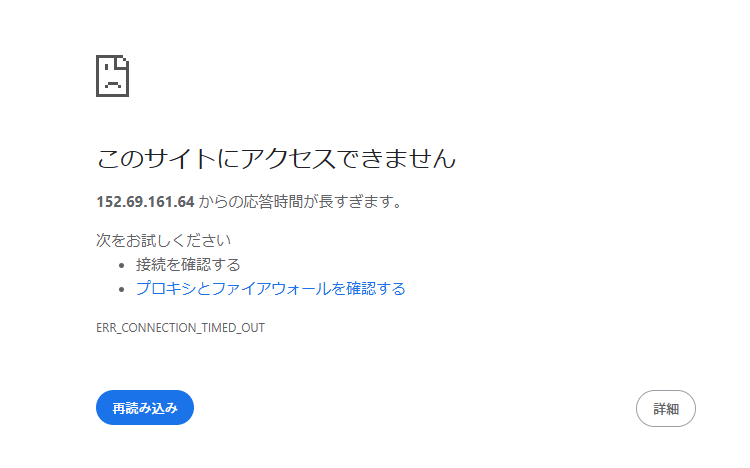

# MuShop のトップページにアクセスできません

## 問題

OCI上に MuShop というペット用品のEコマースアプリケーションが構築されています。このアプリケーションは複数の仮想マシン・インスタンスから構成されるアプリケーション層と、Autonomous Transaction Processing (ATP) で構成されるデータベース層からなり、そのほかに踏み台用の仮想マシンも構成されています。  
MuShop をホストしているアプリケーション・サーバーはOCIロード・バランサの背後にあり、トップページは http://<OCI LoadBalancer パブリック IP アドレス>/ からアクセスできます。しかし現在の状態は、このURLにアクセスしてもタイムアウトになる状態です。この状況を改善し、ブラウザから MuShop のトップページにアクセスできるようにしてください。

 (所要時間：10分程度)

## ヒント

### ヒント1

まず、トップページのURIを特定するために、OCIコンソールでロード・バランサのパブリックIPアドレスを確認しましょう。  
その上で、ご自身のブラウザからトップページのURLにアクセスし、問題が起きている状況を確認します。

### ヒント2

問題の起きている状況は確認できましたか? 確認ができたら、問題の切り分けに移りましょう。  
OCI のネットワーク設定に問題がある可能性がありますので、ネットワークのリソースに着目して、原因を探ってください。  
ネットワークの問題の切り分けにあたっては、OCIのコンソールを直接参照する方法のほかに、ネットワーク・コマンド・センターのツール群などもあります。適切なものを選んで使用してみると役に立つかもしれません。

[ネットワーク・コマンド・センター・サービス](https://docs.oracle.com/ja-jp/iaas/Content/Network/Concepts/net_command_center.htm)

## 解答

このMuShopアプリケーションにおいては、OCIのロード・バランサに適用されているネットワーク・セキュリティ・グループ(NSG)の設定が不適切なため、インターネットからのHTTP通信(tcp/80)がブロックされている状態です。トップページを正しく表示するには以下の作業を実施する必要があります。

1. 対象 OCI LoadBalancer の確認

- OCI コンソール →「ネットワーキング」→「ロード・バランサ」→ 対象のロードバランサをクリック
- 「詳細」タブで、割り当てられている 「mushop」という名前の NSG（ネットワーク・セキュリティ・グループ） をクリック

2. NSG の編集

- 「セキュリティ・ルール」を選択して、「ルールの追加」ボタンをクリック
- 以下の値を設定して、「追加」ボタンをクリック

| 設定項目 | 値 |
| :---- | :---- |
| 方向 | イングレス |
| ソース・タイプ | CIDR |
| ソース CIDR | 0.0.0.0/0 |
| IP プロトコル | TCP |
| ソース・ポート範囲 | All |
| 宛先ポート範囲 | 80 |

3. アクセス確認

ブラウザで http://<OCI LoadBalancer パブリック IP アドレス>/ にアクセスし、MuShop トップページが表示されることを確認します。  
以下のようなページが表示されたら、無事に手順は完了です。

