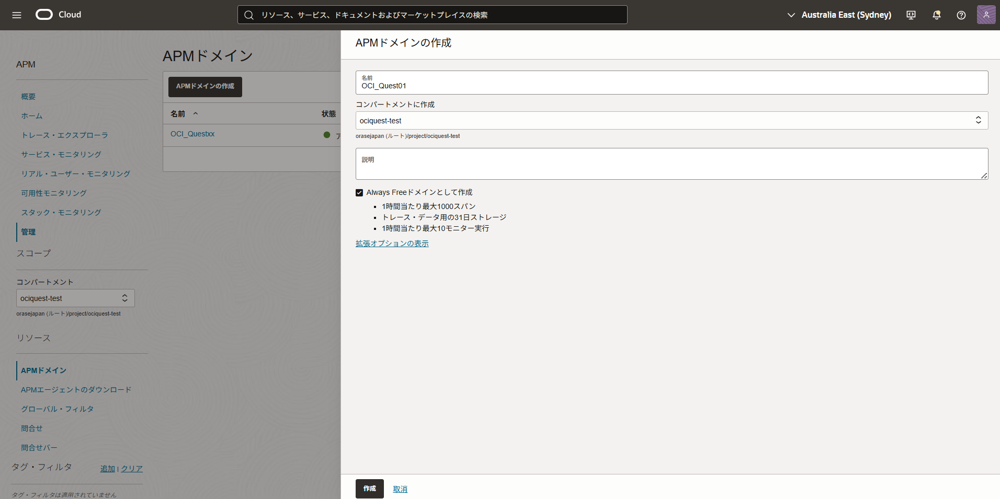
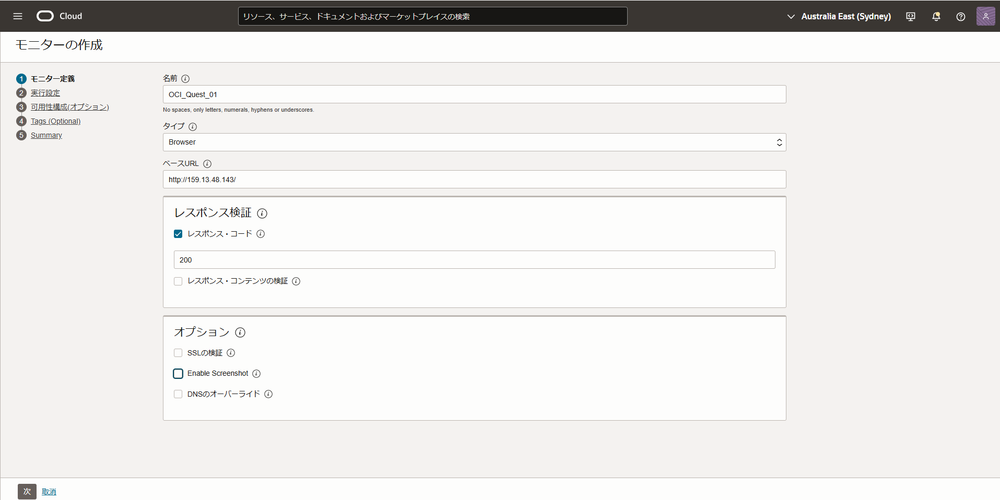
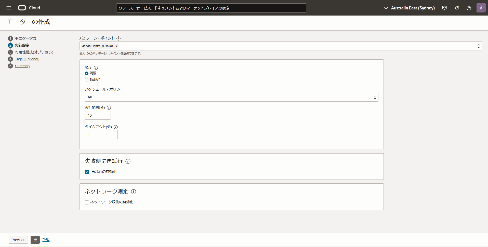
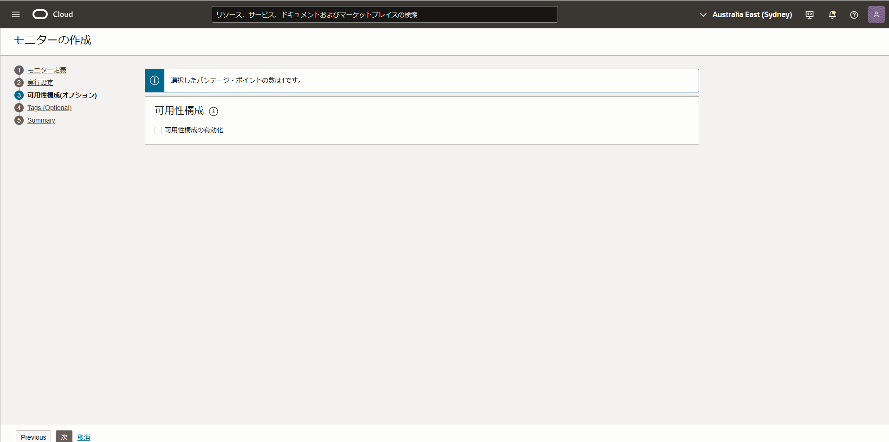
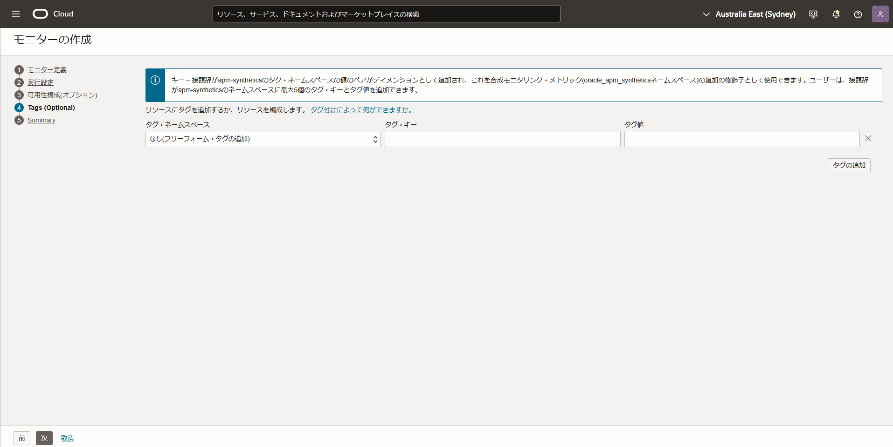
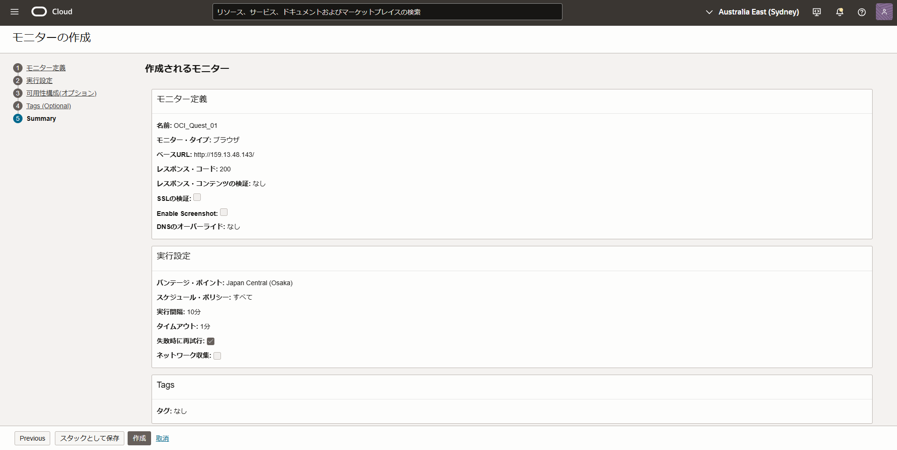
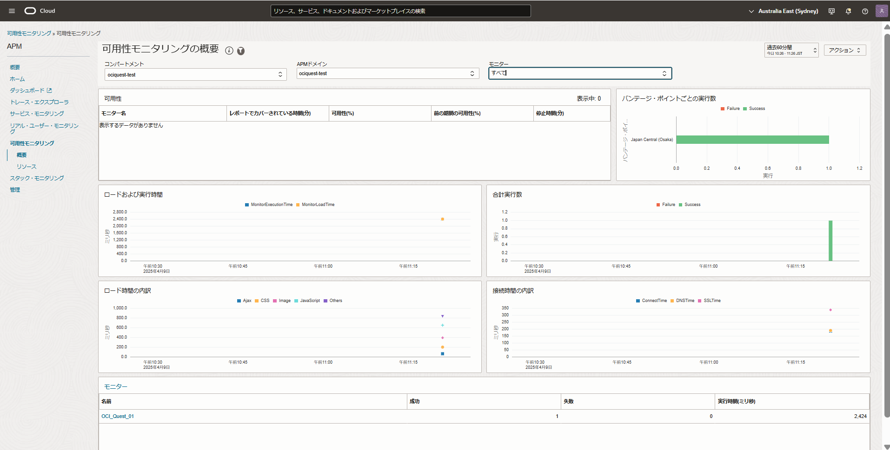

# 外形監視(可用性モニタリング)の仕組みを実装してみよう (所要時間：15-25分程度)
# 問題
サービスの成長に伴い、お客様から「遅い」、「接続しにくい」といった問い合わせが増えてきました。
インフラ、アプリケーションの内部リソースの監視のみでは、上記のような問い合わせに対して、プロアクティブな対応が難しい状況です。
その対応として、外形監視の設定を追加し、アプリケーションの障害をお客様からの連絡より前に検知する対策を実施しようと検討しています。
Oracle Cloud Observability and ManagementのAPMの可用性モニタリングを活用し、MuShopのトップページに対して外形監視の仕組みを実装してください。

実現したい要件
- MuShopのトップページに対して、10分に1回、アクセスをするように外形監視(可用性モニタリング)を実装する (タイムアウトは1分)
- 失敗時は、再実行できるように設定する

設定時の条件について
- APMドメインは、Always Freeドメインとして作成してください。
- バンテージポイントは、日本以外を設定してください。

設定後の確認
- 可用性モニタリングのダッシュボードで外形監視(可用性モニタリング)が正常に実行できていることを確認してください

# 解答 (可用性モニタリングの設定)
- 監視および管理 → アプリケーション・パフォーマンス・モニタリング →　管理を選択

 

- 「APMドメインの作成」を押下し、「APMドメイン」に関する情報を入力

 

- 「モニターの作成」を押下し、「モニターの定義」に関する情報を入力

- 「次」を押下し、「実行設定」に関する情報を入力

- 「次」を押下し、「可用性構成」の画面に遷移 (今回は設定不要)

- 「次」を押下し、「Tags」の画面に遷移 (今回は設定不要)

- 「次」を押下し、「Summary」の画面に遷移し、要件通りに設定されていることを確認し、「作成」を押下

- APM → 可用性モニタリング → 概要を選択し、可用性モニタリングが問題なく動作していることを確認

