# SQLのパフォーマンス・チューニングをしてみよう！ (所要時間：20分程度)


## 問題
アプリケーションの動作が重いとユーザから指摘を受けました。
アプリケーションのパフォーマンスを分析しているエンジニアに調査してもらったところ、アプリケーションに接続しているデータベースのSQLパフォーマンスがボトルネックになっている可能性があることがわかりました。
以下のDatabase Managementの機能を利用して、SQLのパフォーマンスを改善してください。

1. パフォーマンス・ハブでパフォーマンスが悪い以下のSQLを見つけ、SQLモニタリングの画面で実行計画がTable Storage Scanになっていることを確認します。

```パフォーマンスの悪い.sql
select * from (
select q_.* , row_number() over (order by 1) RN___ from (
SELECT 
    CHANNEL_ID, 
    PROD_ID, 
    (SELECT SUM(AMOUNT_SOLD) 
     FROM SHADMIN.SALES s2 
     WHERE s2.PROD_ID = s.PROD_ID 
     AND s2.TIME_ID BETWEEN TO_DATE('2010-01-01', 'YYYY-MM-DD') 
     AND TO_DATE('2020-12-31', 'YYYY-MM-DD')
    ) AS total_sales
FROM 
    SHADMIN.SALES s
WHERE 
    s.TIME_ID BETWEEN TO_DATE('2010-01-01', 'YYYY-MM-DD') 
    AND TO_DATE('2020-12-31', 'YYYY-MM-DD')
GROUP BY 
    CHANNEL_ID, PROD_ID;
```


※上記のSQLが見つからない場合は、クイック選択の時間範囲およびアクティビティ・サマリーのスライダー範囲を広げてください。

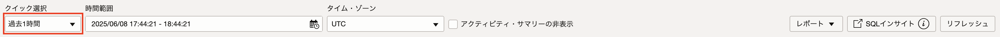
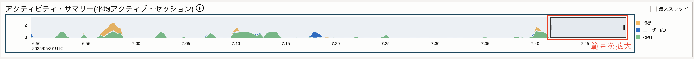


2.ASH分析の画面でSQLチューニング・アドバイザを実行します。

 - SQLチューニング・アドバイザの実行に必要となる情報
   - 合計時間の制限：5分
   - ソース：選択したSQL文
   - 分析の有効範囲：制限あり
   - 資格証明：作成済みの資格証明(admin)
  
3.チューニング・アドバイザを実行し、チューニング・アドバイザの画面で得られた推奨事項を実装します。

 - 推奨事項の実装に必要となる情報
   - 新規索引表領域：デフォルト
   - 資格証明：作成済みの資格証明(admin)
   - ジョブ出力のバケット：作成済みのバケット(job-bucket)
  
4.ジョブの実行が完了したら、ADBにログインしSQLを再度実行します。

 - ログイン情報
  - ユーザ名：SHADMIN
  - パスワード：Welcome12345#


```
SELECT 
    CHANNEL_ID, 
    PROD_ID, 
    (SELECT SUM(AMOUNT_SOLD) 
     FROM SHADMIN.SALES s2 
     WHERE s2.PROD_ID = s.PROD_ID 
     AND s2.TIME_ID BETWEEN TO_DATE('2010-01-01', 'YYYY-MM-DD') 
     AND TO_DATE('2020-12-31', 'YYYY-MM-DD')
    ) AS total_sales
FROM 
    SHADMIN.SALES s
WHERE 
    s.TIME_ID BETWEEN TO_DATE('2010-01-01', 'YYYY-MM-DD') 
    AND TO_DATE('2020-12-31', 'YYYY-MM-DD')
GROUP BY 
    CHANNEL_ID, PROD_ID;
```

5.パフォーマンス・ハブから実行したSQLの実行計画が変わっていることを確認してください。

## 解答
監視および管理→データベース管理→診断と管理をクリックします。<br>
該当のATPをクリックします。
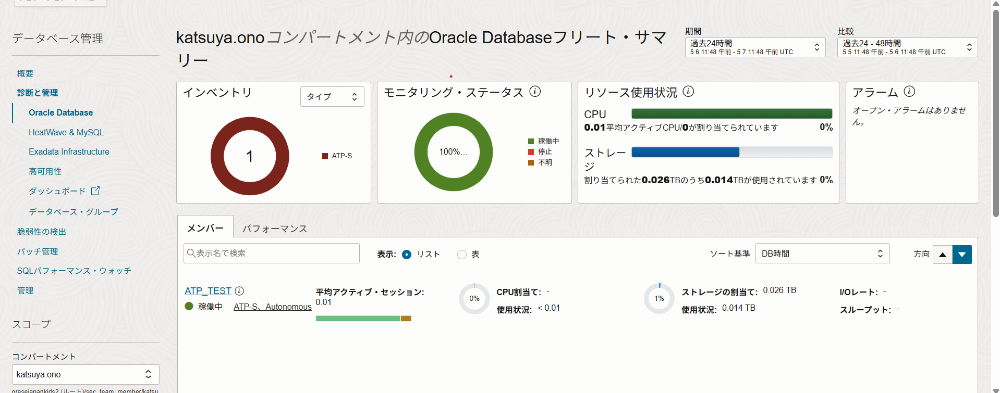

「パフォーマンス・ハブ」をクリックします。
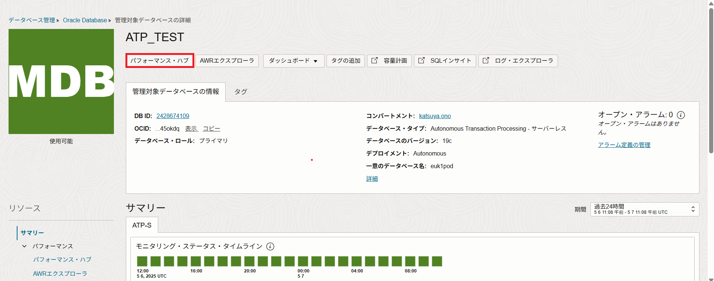

ASH分析から該当のSQLをクリックします。
「SQLのチューニング」をクリックします。
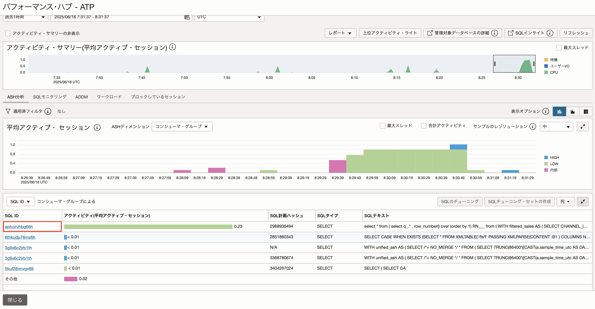

以下の情報を設定し、「実行」をクリックします。
 - 名前：任意の名前
 - ソース：選択したSQL文
 - 合計時間の制限：5分
 - 分析の有効範囲：制限あり
 - 資格証明：作成済みの資格証明

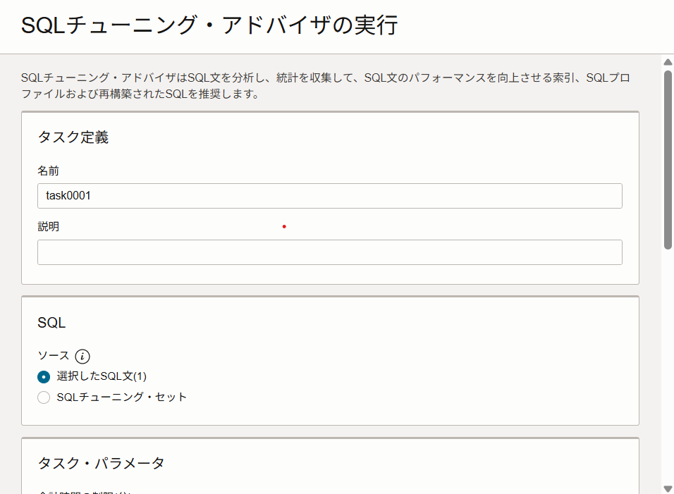
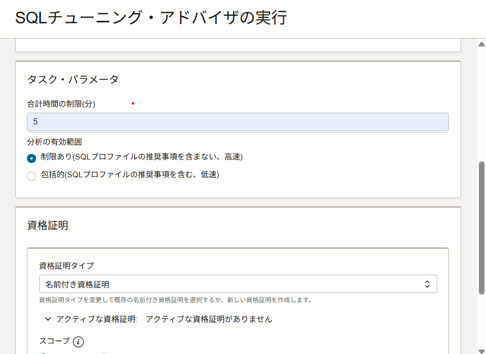
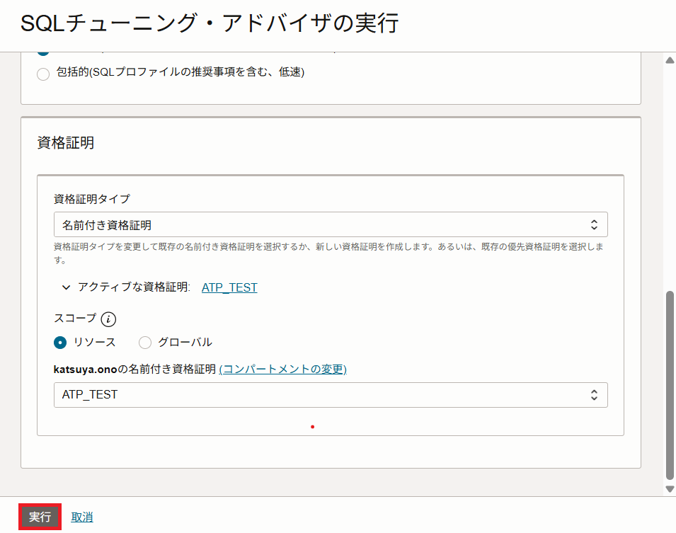

完了するとDatabase ManagementのSQLチューニング・アドバイザに完了済みと表示されるので、該当のタスク名をクリックします。
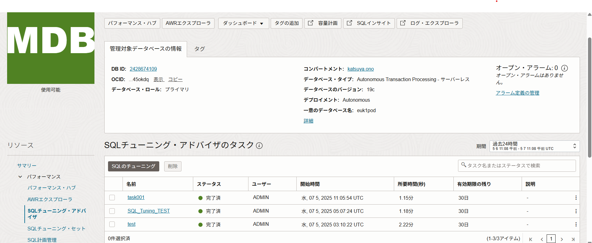

SQL結果をクリックします。<br>
該当のSQLをクリックします。
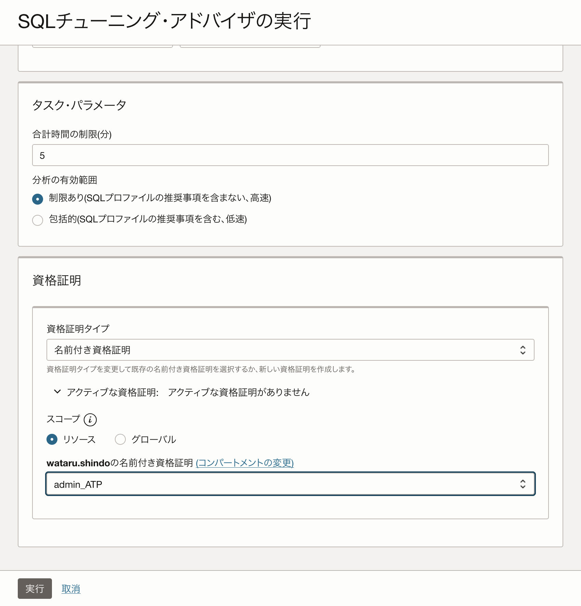

3点リーダーから「推奨事項を実装」をクリックします。
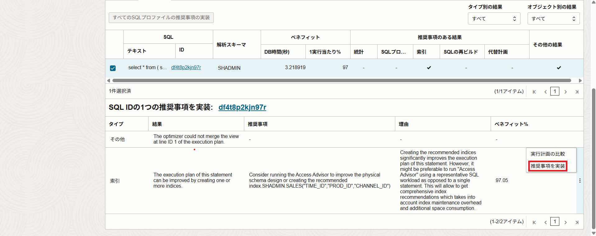
以下の情報を設定し、「推奨事項を実装」をクリックします。
 - 名前：任意の名前
 - 新規索引表領域：デフォルト
 - 資格証明：作成済みの資格証明
 - ジョブ出力のバケット：作成済みのバケット

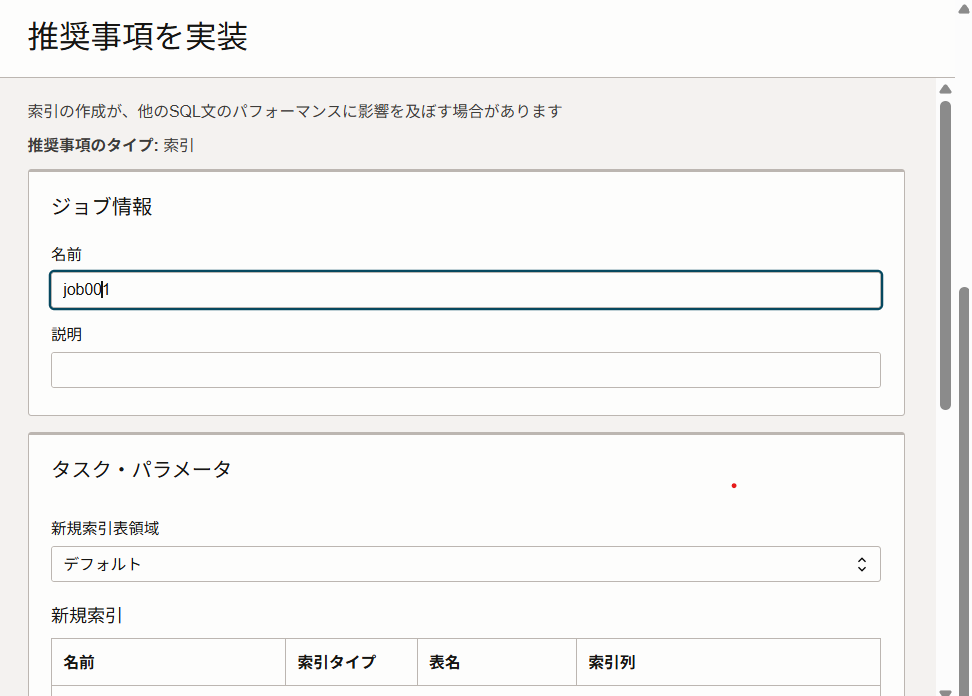
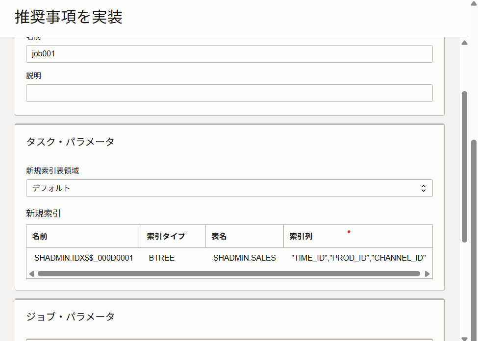
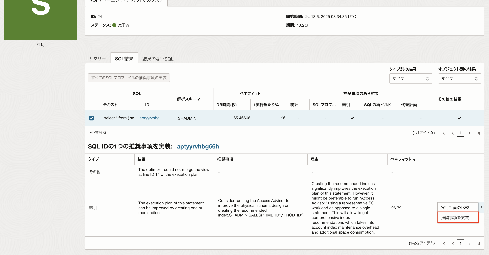

推奨事項を実装が完了すると、ジョブに完了と表示されます。
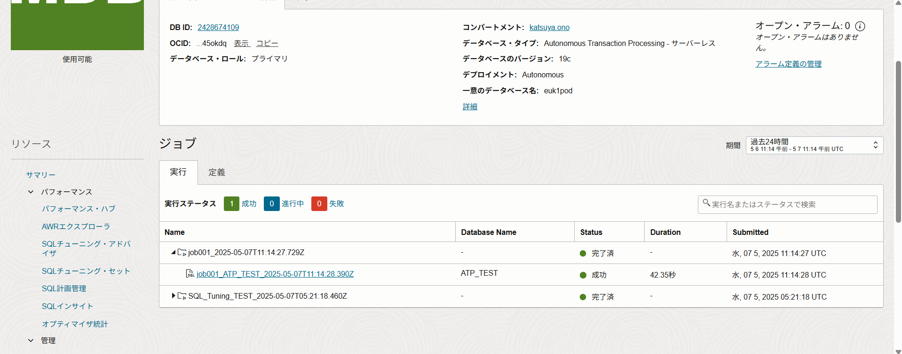


