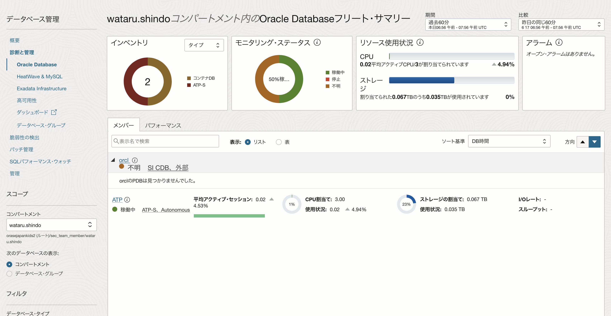
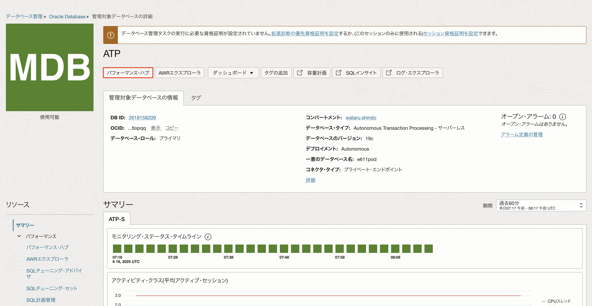

# SQLのパフォーマンス・チューニングをしてみよう！ (所要時間：20分程度)


## 問題
アプリケーションの動作が重いとユーザから指摘を受けました。
アプリケーションのパフォーマンスを分析しているエンジニアに調査してもらったところ、アプリケーションに接続しているデータベースのSQLパフォーマンスがボトルネックになっている可能性があることがわかりました。
以下のDatabase Managementの機能を利用して、SQLのパフォーマンスを改善してください。

利用する機能
 - パフォーマンス・ハブ
   - パフォーマンスが悪い以下のSQLを探索

```
SELECT 
    CHANNEL_ID, 
    PROD_ID, 
    (SELECT SUM(AMOUNT_SOLD) 
     FROM SALES s2 
     WHERE s2.PROD_ID = s.PROD_ID 
     AND s2.TIME_ID BETWEEN TO_DATE('2010-01-01', 'YYYY-MM-DD') 
     AND TO_DATE('2020-12-31', 'YYYY-MM-DD')
    ) AS total_sales
FROM 
    SALES s
WHERE 
    s.TIME_ID BETWEEN TO_DATE('2010-01-01', 'YYYY-MM-DD') 
    AND TO_DATE('2020-12-31', 'YYYY-MM-DD')
GROUP BY 
    CHANNEL_ID, PROD_ID;
```
   
 - SQLチューニング・アドバイザ
   - SQLパフォーマンスを改善するアドバイスを取得
   - アドバイスされた内容を実装

## 解答
監視および管理→データベース管理→診断と管理をクリックします。
該当のATPをクリックします。


「パフォーマンス・ハブ」をクリックします。


ASH分析から該当のSQLをクリックし、「SQLのチューニング」をクリックします。


下記の情報を設定し、「実行」をクリック


