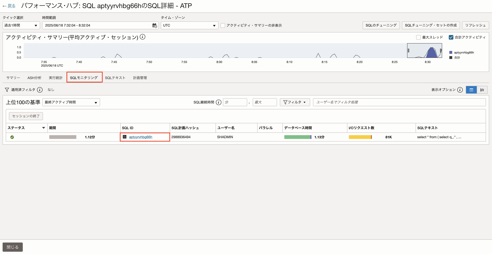
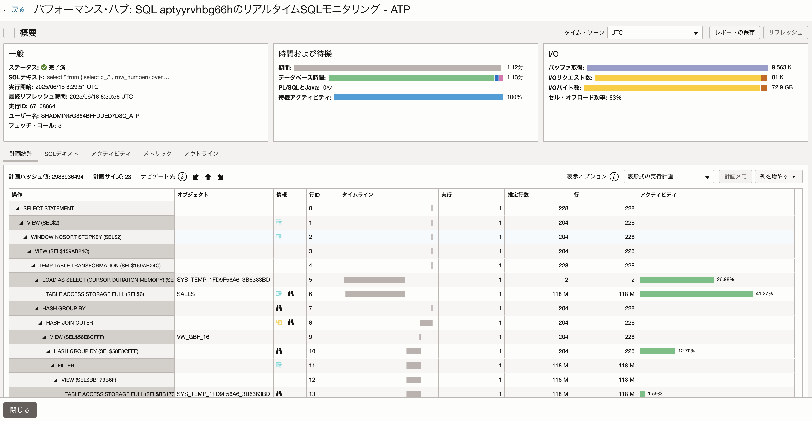
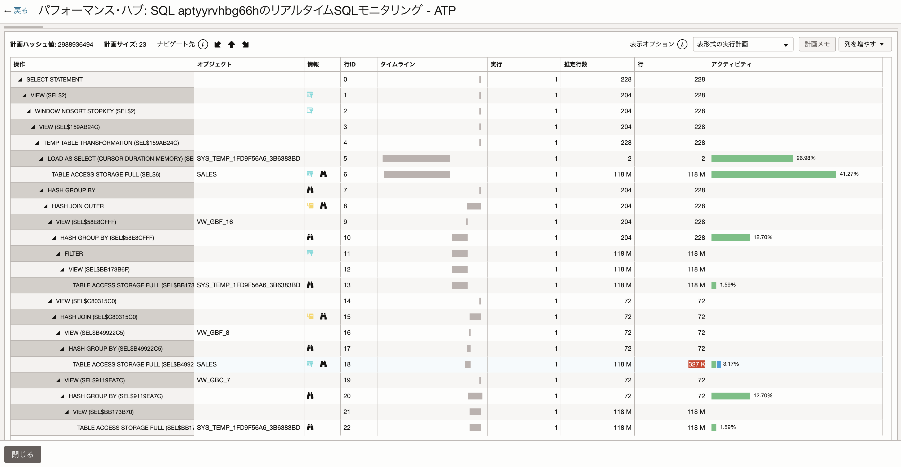
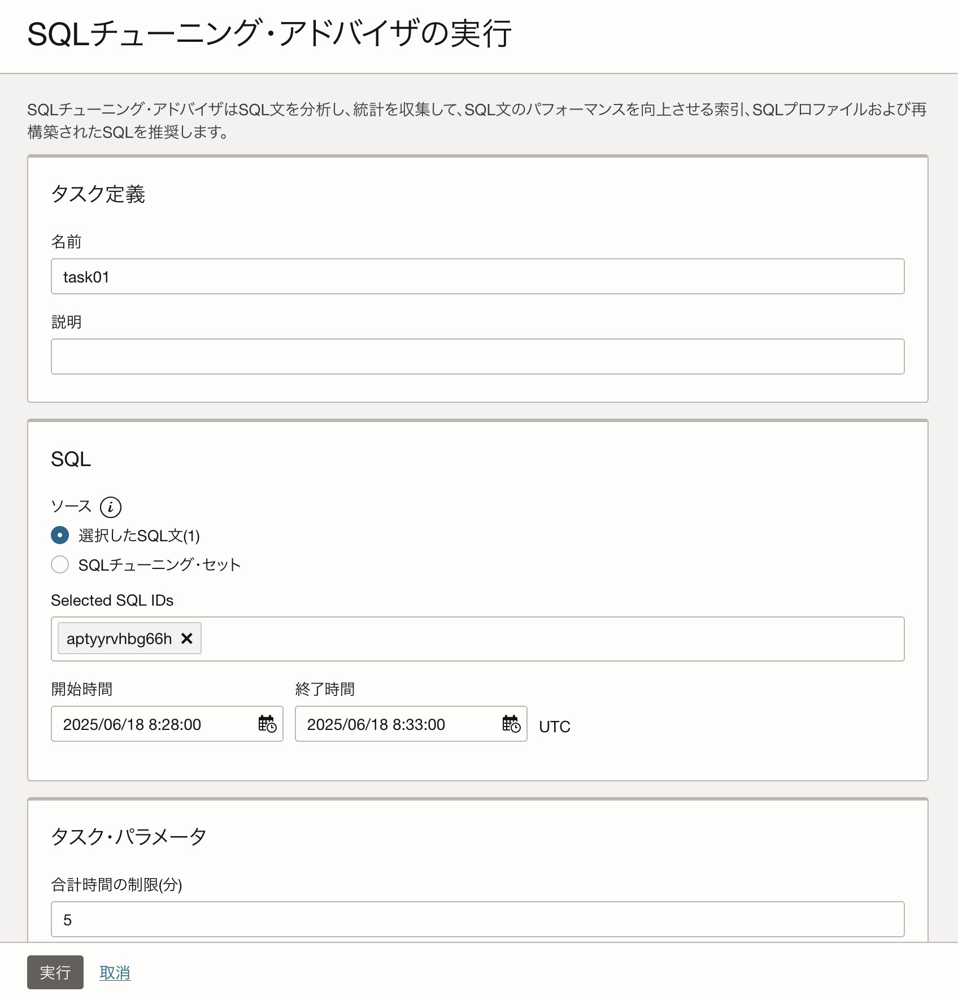
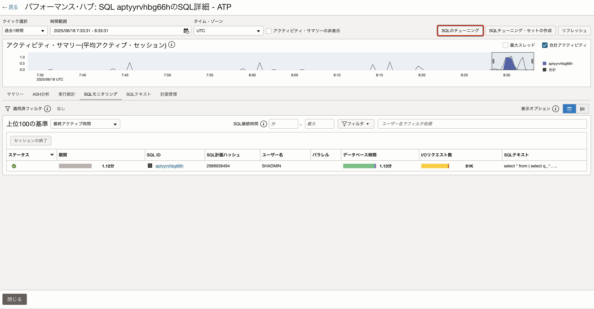
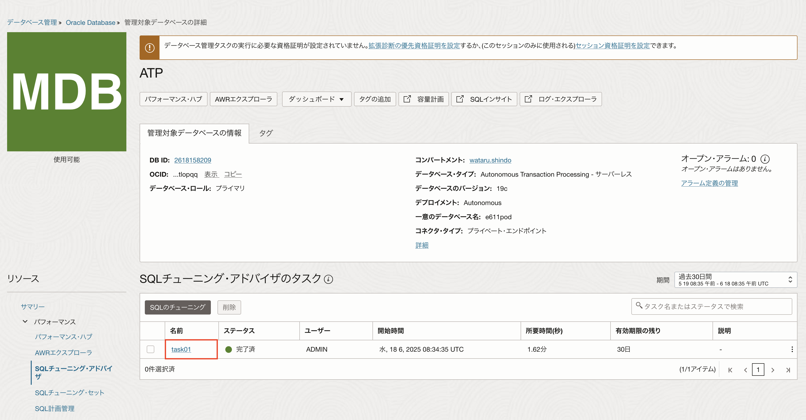
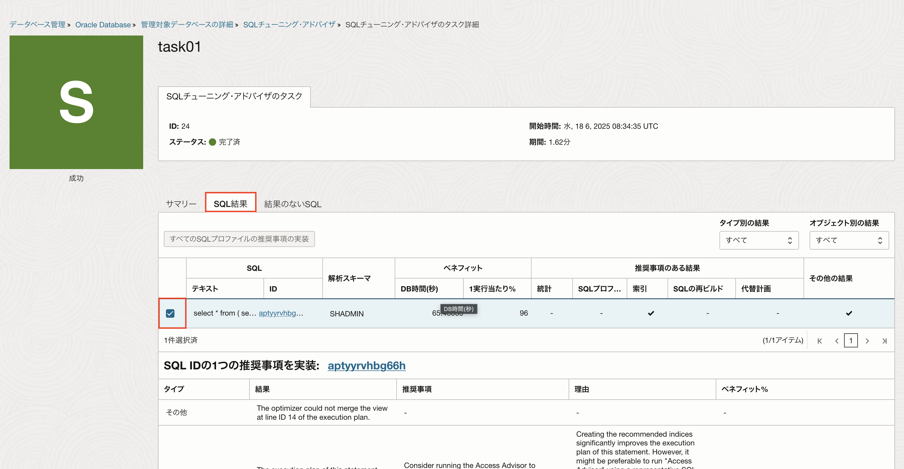
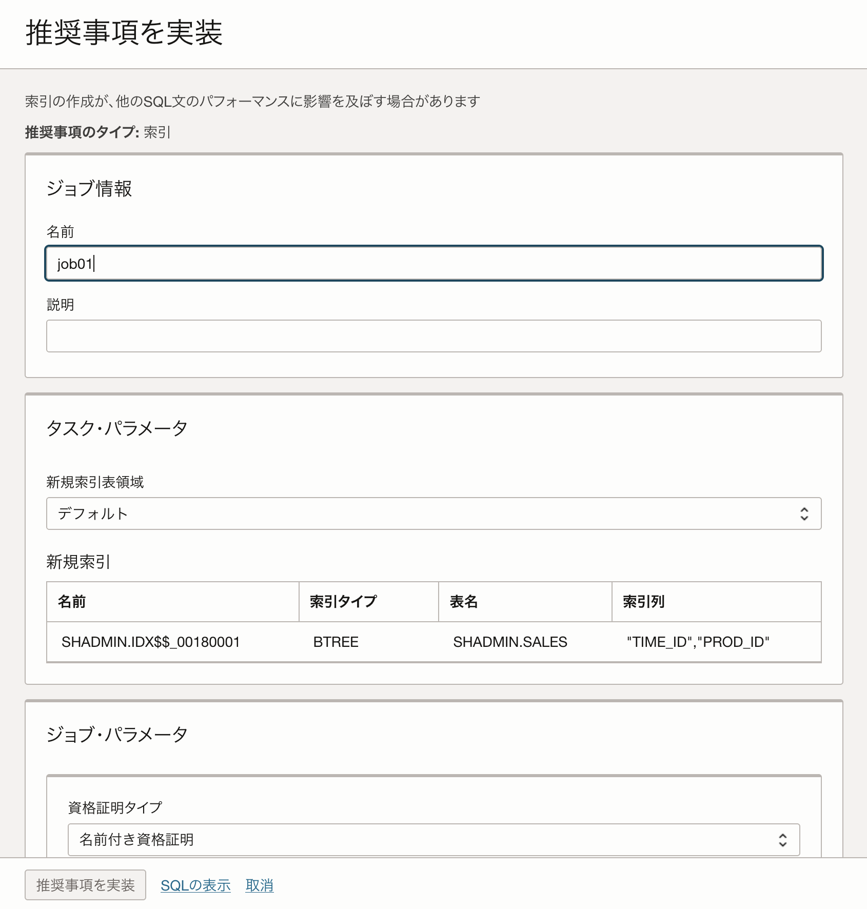

# SQLのパフォーマンス・チューニングをしてみよう！ (所要時間：20分程度)


## 問題
アプリケーションの動作が重いとユーザから指摘を受けました。
アプリケーションのパフォーマンスを分析しているエンジニアに調査してもらったところ、アプリケーションに接続しているデータベースのSQLパフォーマンスがボトルネックになっている可能性があることがわかりました。
以下のDatabase Managementの機能を利用して、SQLのパフォーマンスを改善してください。

### 利用する機能
 - パフォーマンス・ハブ
   - パフォーマンスが悪い以下のSQLを探索

```
SELECT 
    CHANNEL_ID, 
    PROD_ID, 
    (SELECT SUM(AMOUNT_SOLD) 
     FROM SALES s2 
     WHERE s2.PROD_ID = s.PROD_ID 
     AND s2.TIME_ID BETWEEN TO_DATE('2010-01-01', 'YYYY-MM-DD') 
     AND TO_DATE('2020-12-31', 'YYYY-MM-DD')
    ) AS total_sales
FROM 
    SALES s
WHERE 
    s.TIME_ID BETWEEN TO_DATE('2010-01-01', 'YYYY-MM-DD') 
    AND TO_DATE('2020-12-31', 'YYYY-MM-DD')
GROUP BY 
    CHANNEL_ID, PROD_ID;
```
   
 - SQLチューニング・アドバイザ
   - SQLパフォーマンスを改善するアドバイスを取得
   - アドバイスされた内容を実装


※SQLチューニング・アドバイザの実行と推奨事項の実装に必要となる情報は以下を設定してください。<br>
 - SQLチューニング・アドバイザの実行
   - 合計時間の制限：5分
   - ソース：選択したSQL文
   - 分析の有効範囲：制限あり
   - 資格証明：作成済みの資格証明(admin)

 - 推奨事項の実装
   - 新規索引表領域：デフォルト
   - 資格証明：作成済みの資格証明(admin)
   - ジョブ出力のバケット：作成済みのバケット(alpha-job or Beta-job)
     

## 解答
監視および管理→データベース管理→診断と管理をクリックします。<br>
該当のATPをクリックします。


「パフォーマンス・ハブ」をクリックします。


ASH分析から該当のSQLをクリックします。
「SQLのチューニング」をクリックします。


以下の情報を設定し、「実行」をクリックします。
 - 名前：任意の名前
 - ソース：選択したSQL文
 - 合計時間の制限：5分
 - 分析の有効範囲：制限あり
 - 資格証明：作成済みの資格証明





完了するとDatabase ManagementのSQLチューニング・アドバイザに完了済みと表示されるので、該当のタスク名をクリックします。


SQL結果をクリックします。<br>
該当のSQLをクリックします。


3点リーダーから「推奨事項を実装」をクリックします。

以下の情報を設定し、「推奨事項を実装」をクリックします。
 - 名前：任意の名前
 - 新規索引表領域：デフォルト
 - 資格証明：作成済みの資格証明
 - ジョブ出力のバケット：作成済みのバケット





推奨事項を実装が完了すると、ジョブに完了と表示されます。



