# Logging AnalyticsでOCI Audit Logsを管理・分析してみよう！ (所要時間：20分程度)

## 問題
セキュリティインシデントや意図しないリソースの削除などに備え、OCI Audit Logsのログ管理および分析を実施する必要があります。
下記要件を実現できるダッシュボードの作成およびアラートの設定を実施してください。

### ダッシュボード要件
1. 異常なログが発生しているかどうか確認できる（クラスタ分析）
2. 削除されたリソースを確認できる（円グラフ）
    - 実行されたActionの内訳（create、update、Deleteなど）はフィールドのActionTyoeから確認できます。
    - 削除されたリソースはフィールドのEventから確認できます。
4. 異常な場所からログインが実施されていないことを確認できる (マップ)
5. ユーザ毎のログイン成功を確認できる (ヒストグラム付きレコード)
6. ユーザ毎のログイン失敗を確認できる (ヒストグラム付きレコード)

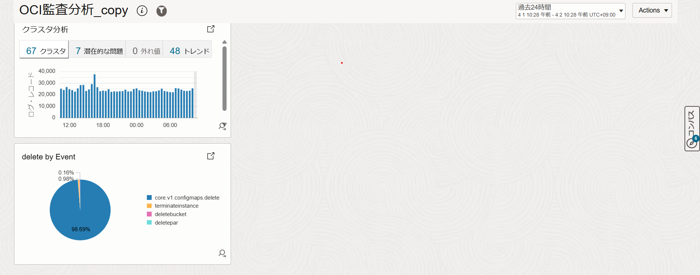
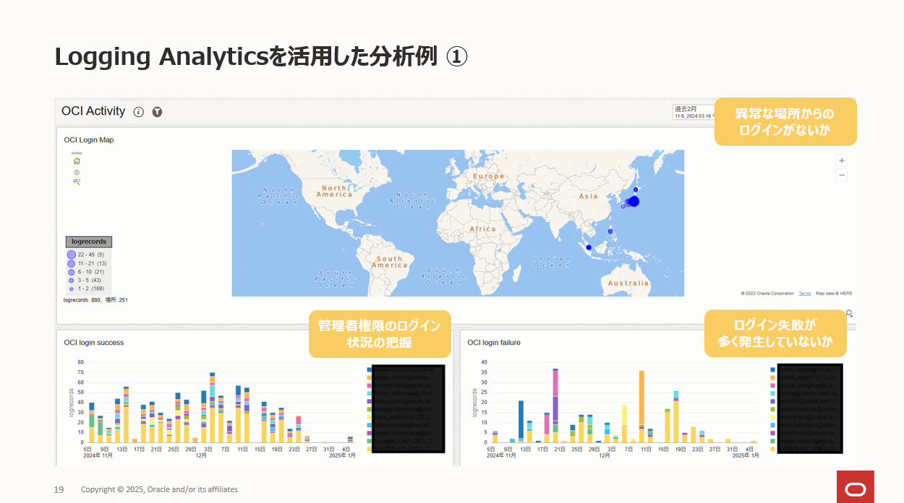

### アラート要件
1. ログイン失敗が発生したらアラートをメールアドレスに通知する
2. Object Storageのバケットが削除されたらメールアドレスに通知する

## 解答
まず要件を満たすダッシュボードを作成します。
ダッシュボードはログ・アナリティクス→ダッシュボード→ダッシュボードの作成をクリックします。
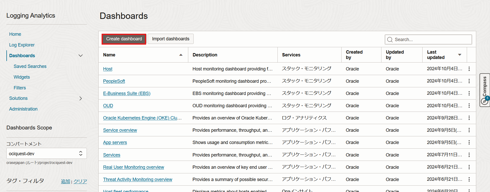

ダッシュボードに任意の名前を入力し、作成をクリックします。
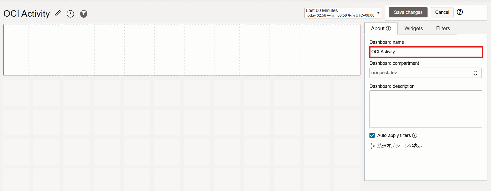

作成したダッシュボードに要件を追加します。
ログ・エクスプローラの画面から、OCI AUdit Logを選択します。
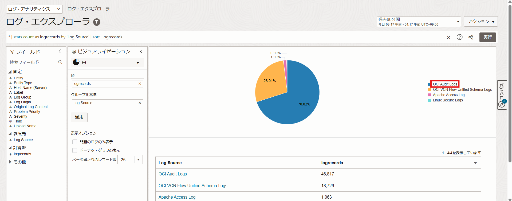

### ダッシュボード要件
1. 異常なログが発生しているかどうか確認できる（クラスタ分析） 
   クラスタ分析はビジュアライゼーションメニューからクラスタ分析を選択します。
   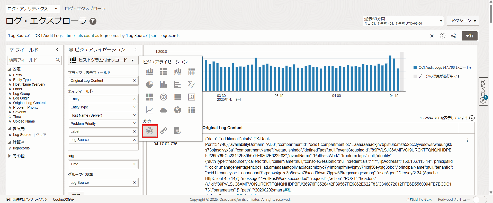
   クラスタ分析の結果が表示されるので、作成したダッシュボードにクラスタ分析の結果を追加します。 
   アクション→名前を付けて保存をクリックします。
   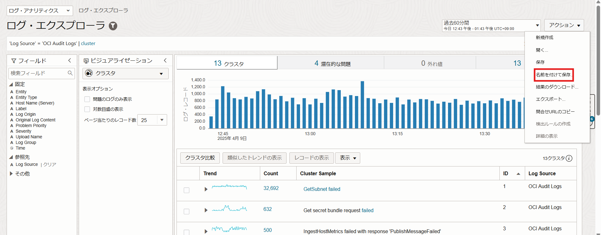
   
   以下の項目を設定し、「保存」をクリックするとダッシュボードにクラスタ分析の結果が追加されます。
    - 検索名：任意の検索名
    - ダッシュボードに追加
    - 既存のダッシュボードに追加
    - ダッシュボード：作成したダッシュボードを選択
    
   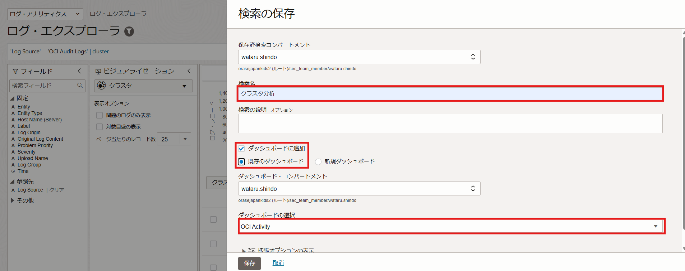
   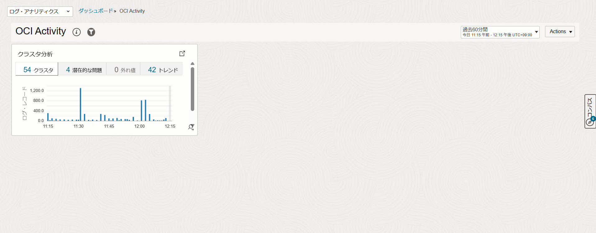
   

3. 削除されたリソースを確認できる（円グラフ） 
   ログ・エクスプローラから、フィールドのAction Typeからdeleteをチェックを入れて
   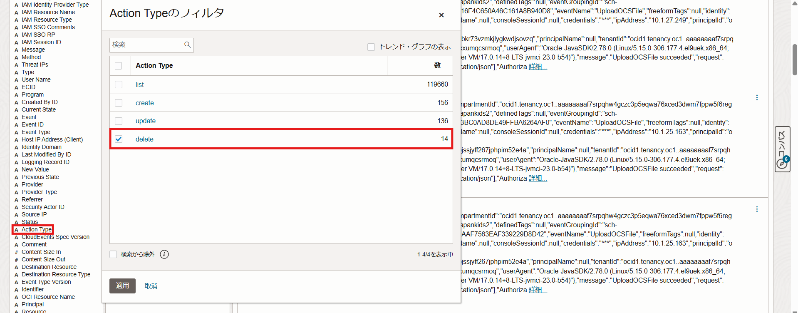
   
   グループ化基準にEventをドラック&ドロップします。
   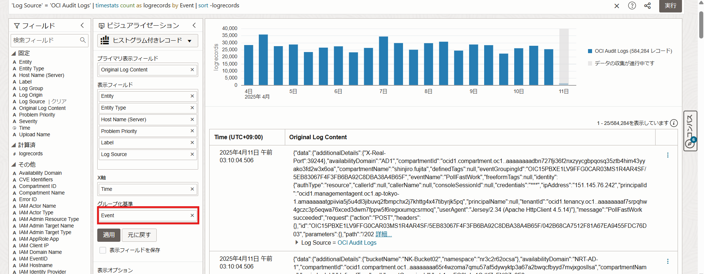
   
   削除されたリソースが表示されるので、作成したダッシュボードに追加します。 
   アクション→名前を付けて保存をクリックするとダッシュボードに追加されます。
   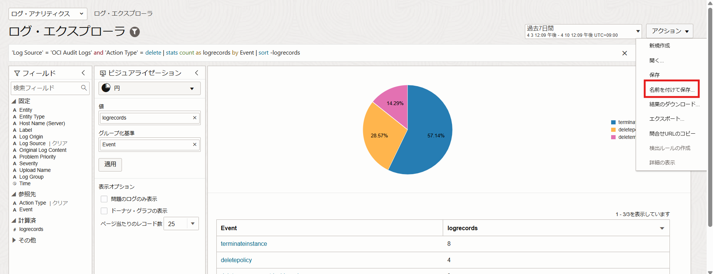
   
   要件1と同様に以下の項目を設定し、「保存」をクリックします。
    - 検索名：任意の検索名
    - ダッシュボードに追加
    - 既存のダッシュボードに追加
    - ダッシュボード：作成したダッシュボードを選択
   
   
   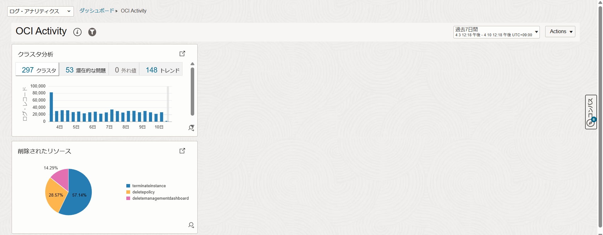

   
   

5. 異常な場所からログインが実施されていないことを確認できる (マップ)

6. ユーザ毎のログイン成功を確認できる (ヒストグラム付きレコード)

7. ユーザ毎のログイン失敗を確認できる (ヒストグラム付きレコード)

### アラート要件
1. ログイン失敗が発生したらアラートをメールアドレスに通知する
2. Object Storageのバケットが削除されたらメールアドレスに通知する
