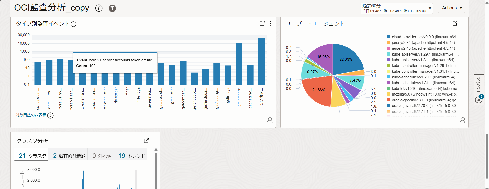
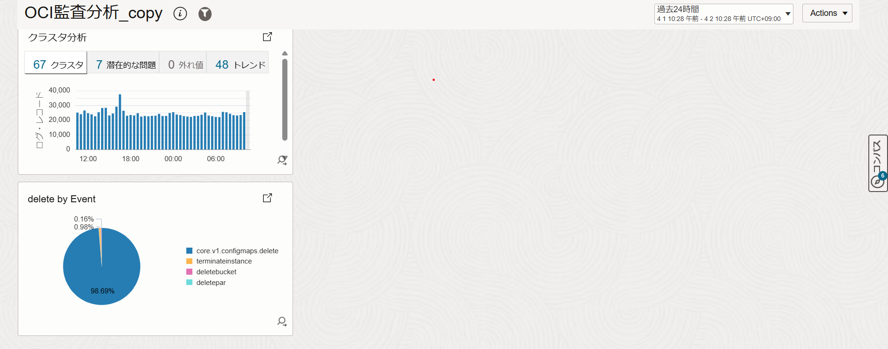
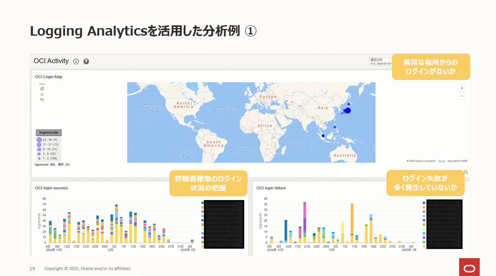
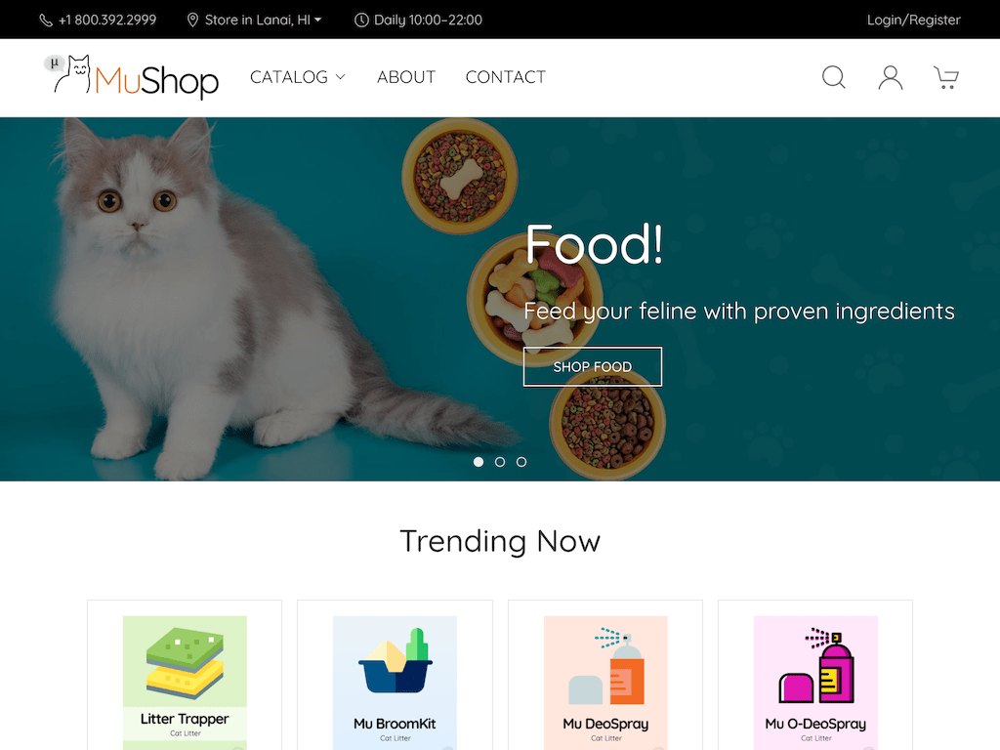

Logging AnalyticsのOCI Audit Logsに関する問題
# 問題1
Logging Analyticsにはクラスタ分析というログを4つのカテゴリに自動で分類してくれる機能があり、障がいやセキュリティに関連する問題が発生した際に重要なログをすぐに特定可能です。
OCI Audit Logsには事前に用意されているOCI 監査分析ダッシュボードありますが、クラスタ分析の結果がないので新たに追加する必要があります。
OCI 監査分析ダッシュボードを複製して、クラスタ分析の結果を複製したダッシュボードから確認できるようにしてください。


# 問題2
OCIを操作しているユーザがログを格納しているオブジェクト・ストレージのバケットを削除してしまったので、オブジェクト・ストレージにログを格納できなくなってしまいました。
同様の事象が発生した際（オブジェクト・ストレージのバケットが誤って削除されたとき）にユーザに通知がされるように、アラームを設定してください。
また実際にオブジェクト・ストレージのバケットを作成して、そのバケットが削除された際にアラームが発報されるかどうか確認してください。

# 問題3
セキュリティインシデントなどに備え、セキュリティ関連のログ管理および分析を実施する必要があります。下記要件を実現できるダッシュボードの作成およびアラートの設定を実施してください。
                
ダッシュボード要件
 - 異常な場所からログインが実施されていないことを確認できる (マップ)
 - ユーザ毎のログイン成功を確認できる (ヒストグラム付きレコード)
 - ユーザ毎のログイン失敗を確認できる (ヒストグラム付きレコード)

アラート要件
 - ログイン失敗が発生したらアラートを下記メールアドレスに通知する


# 問題（マージ）
セキュリティインシデントや意図しないリソースの変更などに備え、OCI Audit Logsのログ管理および分析を実施する必要があります。
下記要件を実現できるダッシュボードの作成およびアラートの設定を実施してください。

ダッシュボード要件
 - 異常なログが発生しているかどうか確認できる（クラスタ分析）
 - 削除されたリソースを確認できる（円グラフ）
 - 異常な場所からログインが実施されていないことを確認できる (マップ)
 - ユーザ毎のログイン成功を確認できる (ヒストグラム付きレコード)
 - ユーザ毎のログイン失敗を確認できる (ヒストグラム付きレコード)




アラート要件
 - ログイン失敗が発生したらアラートを下記メールアドレスに通知する
 - Object Storageのバケットが削除されたら下記メールアドレスに通知する


## 見出し
### 見出し

テキストテキストテキスト

```sh
コマンド
```


*キャプション*

# 解答
