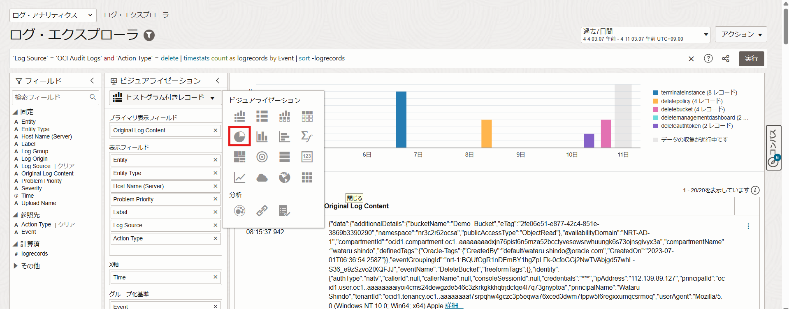
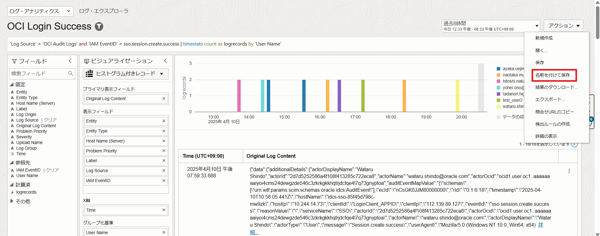

# Logging AnalyticsでOCI Audit Logsを管理・分析してみよう！ (所要時間：20分程度)

## 問題
アプリケーションを構築しているOCI環境のセキュリティインシデントや意図しないリソースの削除などに備え、OCI Audit Logsのログ管理および分析を実施する必要があります。
下記要件を実現できるダッシュボードの作成およびアラートの設定を実施してください。

### ダッシュボード要件
1. 異常なログが発生しているかどうか確認できる（クラスタ分析）
2. 削除されたリソースを確認できる（円グラフ）
    - 実行されたActionの内訳（create、update、Deleteなど）はフィールドの「ActionType」を利用します。
    - 削除されたリソースはフィールドの「Event」を利用します。
4. 異常な場所からログインが実施されていないことを確認できる (マップ) 
    - 成功したログイン（sso.session.create.success）はフィールドの「IAM EventID」を利用します。
6. ユーザ毎のログイン成功を確認できる (ヒストグラム付きレコード) 
    - 成功したログイン（sso.session.create.success）はフィールドの「IAM EventID」を利用します。
8. ユーザ毎のログイン失敗を確認できる (ヒストグラム付きレコード) 
     - 失敗したログイン（sso.session.create.failure）はフィールドの「IAM EventID」を利用します。

### アラート要件
1. ログイン失敗が発生したらアラートをメールアドレスに通知する
2. Object Storageのバケットが削除されたらメールアドレスに通知する

## 解答
まず要件を満たすダッシュボードを作成します。
ダッシュボードは「ログ・アナリティクス」→「ダッシュボード」→「ダッシュボードの作成」をクリックします。

ダッシュボードに「任意の名前」を入力し、「作成」をクリックします。

作成したダッシュボードに要件を追加します。
ログ・エクスプローラの画面から、「OCI AUdit Log」を選択します。

### ダッシュボード要件
1. 異常なログが発生しているかどうか確認できる（クラスタ分析） 
   ビジュアライゼーションメニューから「クラスタ分析」を選択します。
   
   クラスタ分析の結果が表示されるので、作成したダッシュボードにクラスタ分析の結果を追加します。 
   アクション→名前を付けて保存をクリックします。
   
   
   以下の項目を設定し、「保存」をクリックするとダッシュボードにクラスタ分析の結果が追加されます。
    - 検索名：任意の検索名
    - ダッシュボードに追加
    - 既存のダッシュボードに追加
    - ダッシュボード：作成したダッシュボードを選択
    
   
   
   
   

3. 削除されたリソースを確認できる（円グラフ） 
   ログ・エクスプローラから、フィールドの「Action」から「delete」をクリックして適用をクリックします。
   
   
   
   グループ化基準にEventをドラック&ドロップします。
   
   

   ビジュアライゼーションメニューか「円グラフ」を選択します。
   
   
   
   要件を満たした結果が表示されるので、、作成したダッシュボードに追加します。 
   「アクション」→「名前を付けて保存」をクリックします。
   
   
   
   要件1と同様に以下の項目を設定し、「保存」をクリックするとダッシュボードに追加されます。
    - 検索名：任意の検索名
    - ダッシュボードに追加
    - 既存のダッシュボードに追加
    - ダッシュボード：作成したダッシュボードを選択
   
   
   
   

5. 異常な場所からログインが実施されていないことを確認できる (マップ) 
   フィールドの「IAM EventID」から「sso.session.create.success」にチェックを入れて適用をクリックします。
   
   
   
   ビジュアライゼーションメニューからマップを選択します。
   
   

   要件を満たした結果が表示されるので、作成したダッシュボードに追加します。 
   「アクション」→「名前を付けて保存」をクリックします。
   
   
   
   要件1と同様に以下の項目を設定し、「保存」をクリックするとダッシュボードに追加されます。
    - 検索名：任意の検索名
    - ダッシュボードに追加
    - 既存のダッシュボードに追加
    - ダッシュボード：作成したダッシュボードを選択
    
   
   
   
   
   

7. ユーザ毎のログイン成功を確認できる (ヒストグラム付きレコード) 
   フィールドの「IAM EventID」から「sso.session.create.success」にチェックを入れて適用をクリックします。
   
   
   
   グループ化基準に「User Name」をドラック&ドロップします。
   
   

   要件を満たした結果が表示されるので、、作成したダッシュボードに追加します。 
   「アクション」→「名前を付けて保存」をクリックします。
   
   
   
   要件1と同様に以下の項目を設定し、「保存」をクリックするとダッシュボードに追加されます。
    - 検索名：任意の検索名
    - ダッシュボードに追加
    - 既存のダッシュボードに追加
    - ダッシュボード：作成したダッシュボードを選択
    
   
   
   

9. ユーザ毎のログイン失敗を確認できる (ヒストグラム付きレコード)
   フィールドの「IAM EventID」から「sso.session.create.success」にチェックを入れて適用をクリックします。
   
   
   
   グループ化基準に「User Name」をドラック&ドロップします。
   
   

   要件を満たした結果が表示されるので、、作成したダッシュボードに追加します。 
   アクション→名前を付けて保存をクリックします。
   
   
   
   要件1と同様に以下の項目を設定し、「保存」をクリックするとダッシュボードに追加されます。
    - 検索名：任意の検索名
    - ダッシュボードに追加
    - 既存のダッシュボードに追加
    - ダッシュボード：作成したダッシュボードを選択
    
   
   
   

### アラート要件
1. ログイン失敗が発生したらアラートをメールアドレスに通知する
   
2. リソースが削除されたらメールアドレスに通知する

