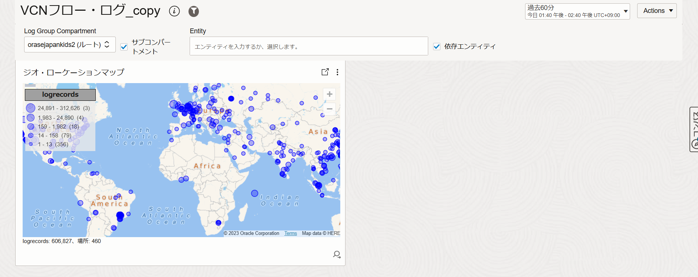

Logging AnalyticsのVCN Flow Logsに関する問題
# 問題1
Logging Analyticsにはクライアントの位置情報を示すジオ・ローケーションマップを表示させる機能があります。
OCI VCNフロー・ログのダッシュボードにはジオ・ローケーションマップの結果がないので、新たに追加する必要があります。VCNフローログのダッシュボードを複製して、下記のようなジオ・ローケーションマップを複製したダッシュボードに追加してください。


# 問題2


## 見出し
### 見出し

テキストテキストテキスト

```sh
コマンド
```


# 解答
