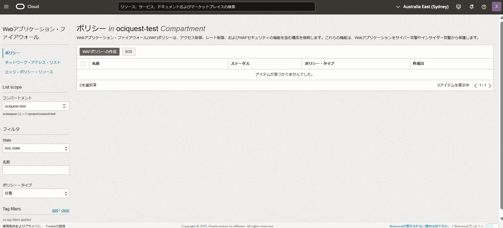

# Webアプリケーションの脆弱性を狙ったサイバー攻撃の対策をしよう (所要時間：20分程度)
# 問題
Webアプリケーションの脆弱性を狙ったサイバー攻撃により、多くの企業で被害を受けています。本格的な攻撃にさらされると、企業や組織の売上や信用に大きなダメージを与えます。
サービスの成長に伴い、利用者も増えていることから、Webアプリケーションの脆弱性を狙ったサイバー攻撃への対応の検討を本格的に進めるよう上層部から指示がありました。
そのため、OCIのWeb Application Firewallの検証を実施することになりました。下記要件を満たすことができるように設定を実施してください。

本問題開始時の前提条件
- MuShop のトップページに接続できない！の問題が完了していること

実現したい要件
- 下記条件に該当するアクセスがあった場合は、401コードを返却する
   - 日本国内からのアクセスがあった場合
   - 1秒以内に同一のIPアドレスから100回以上アクセスがあった場合
   - 保護機能(Oracleのベストプラクティス)の条件に該当するアクセスがあった場合
 
設定後の確認 
- Web Application Firewallの設定後に、MuShopのトップページにアクセスし、401コードが表示されることを確認してください

# 解答 (WAFの設定)
- アイデンティティとセキュリティ→ Webアプリケーション・ファイアウォールを選択
  - 画面起動後、ポリシーを選択
 
 

- 「WAFポリシーの作成」を押下し、「基本情報」に関する情報を入力
   - 名前 (任意の名称)
   - WAFポリシー・コンパートメント (対象のコンパートメントを選択)    

 

- 「次」を押下し、「アクセス制御の有効化」をチェックし、「アクセス・ルールの追加」を選択後、アクセス制御に関する情報を入力
   - 名前 (任意の名称)
   - Condition type (Country/Resionを選択)
   - Operator (in listを選択)
   - Countries (Japanを選択)
   - アクション名 (Pre-configured 401 Response Code Actionを選択)

- 情報入力後、「アクセス・ルールの追加」を選択
- デフォルト・アクションは、Pre-configured Allow Actionのままで、「次」を選択

 

- 「レート制限ルールの構成の有効化」をチェックし、「レート制限ルールの追加」を選択後、レート制限に関する情報を入力
　 - 名前 (任意の名称)
   - リクエスト制限 (100を入力)
   - 期間 (1を入力)
   - アクション名 (Pre-configured 401 Response Code Actionを選択)

 - 情報入力後、「レート制限ルールの追加」を選択
 - 「次」を選択

- 「保護ルールの構成の有効化」をチェックし、「リクエスト保護ルールの追加」を選択後、保護ルールに関する情報を入力
   - 名前 (任意の名称)
   - アクション名 (Pre-configured 401 Response Code Actionを選択)
   - 「保護機能の選択」を選択
   - 「タグによるフィルタ」にRecommendedを入力
   - 表示された保護ルールを全て選択し、「保護機能の選択」を選択
   - 「リクエスト保護ルールの追加」を選択
   - 「次」を選択

- 「次」を押下し、「強制ポイントの選択」に関する情報を入力

- 「次」を押下し、「確認および作成」で設定内容を確認し、「WAFポリシーの作成」を選択

- 作成されたポリシーを選択し、正常に作成できていることを確認

# 解答 (設定後の確認)

- MuShopのトップページにアクセス後、401コードが表示されることを確認

  

