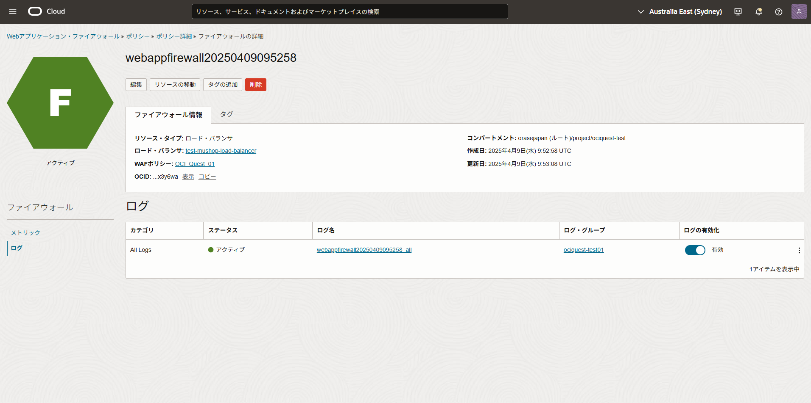

# Web Application FirewallのログをLogging Analyticsで分析できるようにしよう (所要時間：20分程度)
# 問題
「Webアプリケーションの脆弱性を狙ったサイバー攻撃の対策をしよう」の課題で、Web Application Firewall(以下 WAF)を構築しました。
構築後、攻撃の可視化と検出、誤検知の調整をするため、WAFのログを参照、分析できる仕組みを準備する必要があります。下記要件を満たすことができるように設定を実施してください。

本問題開始時の前提条件
- Webアプリケーションの脆弱性を狙ったサイバー攻撃の対策の問題が完了していること

実現したい要件
- WAFのログをLogging Analyticsで可視化する仕組みを構築する

設定時の条件について
- コネクタ・ハブは自チームのコンパートメント内に新規作成してください
 
設定後の確認
- 「監視および管理」→ 「ログ・アナリティクス」→「ログ・エクスプローラ」を選択し、WAFのログが収集されていることを確認してください
  

# 解答
- アイデンティティとセキュリティ→ Webアプリケーション・ファイアウォールを選択
  - 画面起動後、作成したWebアプリケーション・ファイアウォールを選択
 
 

- 「ファイアウォール」を選択

 

- 「ファイアウォール名」を選択

 

- 「ログ」を選択

- 「ログの有効化」から有効化

- 「新規グループの作成」を選択

- 「名前」に任意のログ・グループ名を入力し、「作成」を選択

- 「ログの有効化」を選択

- アクティブな状態になることを確認

- 「監視および管理」→ 「ログ・アナリティクス」→「管理」を選択

- 「ログ・グループの作成」を選択

- 任意の「名前」を入力し、「作成」を選択

- 「監視および管理」→ 「ロギング」→「コネクタ」を選択

- 「コネクタの作成」を選択

- 「コネクタの作成」画面で下記項目を入力
   - コネクタ名 (任意の名称)
   - リソース・コンパートメント (チームに割り当てられたコンパートメント)
   - コネクタの構成
     - ソース (ロギング)
     - ターゲット (ログ・アナリティクス)
   - ソースの構成
     - コンパートメント名 (チームに割り当てられたコンパートメント)
     - ログ・グループ (本問題で作成したLoggingのログ・グループ)
     - ログ (本問題で有効化したログ名)

 - ターゲットの構成
     - コンパートメント  (チームに割り当てられたコンパートメント)
     - ログ・グループ (本問題で作成したLogging Analyticsのログ・グループ)

- デフォルト・ポリシーの「作成」を選択

- ポリシーが作成されたことを確認

- コネクタがACTIVEになることを確認

- 「監視および管理」→ 「ログ・アナリティクス」→「ログ・エクスプローラ」を選択

- ログが収集できていることを確認

